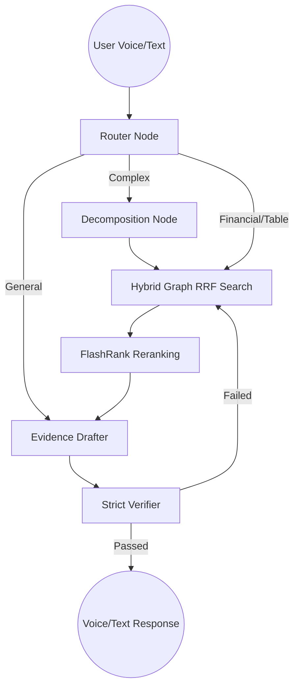

# FinAdvisor-X: Agentic Hybrid Graph RAG Voice Assistant 🎙️📈

FinAdvisor-X is a production-ready, state-of-the-art **Agentic Retrieval-Augmented Generation (RAG)** pipeline. It utilizes **Neo4j** (Graph Database), **LangGraph** (Agentic Workflows), and **Groq's Llama-3.3 & Whisper** to parse, reason over, and vocally answer complex financial queries based on Apple Inc.'s 2024 Annual Report.

The application features a gorgeous "Siri-style" Voice UI built in Streamlit.

## 🌟 Key Features

* **Advanced Hybrid Retrieval**: Combines Neo4j Vector Search with Knowledge Graph extraction, merged via Reciprocal Rank Fusion (RRF), and locally reranked using FlashRank.
* **Agentic LangGraph Architecture**: 
  * **Router Node**: Intelligently classifies questions (Vector/Graph search, Financial Math, Table Lookup, or Direct Answer).
  * **Decomposition**: Breaks complex questions down into atomic sub-queries for thorough retrieval.
  * **Self-RAG Verifier**: A strict multi-hop loop that audits drafted answers for hallucination, numerical consistency, and citation provenance. If verification fails, it autonomously loops back to retrieve more data.
* **Voice Assistant Mode**: Seamless Voice-to-Text via **Groq Whisper** and Text-to-Speech via **gTTS**.
* **Beautiful Streamlit UI**: A dark-mode, single-conversation "Siri-like" animated orb interface replacing the traditional clunky chatbot layout.

## 🏗️ Architecture



## 🚀 Quickstart for Streamlit Cloud (100% Free)

This repository has been deeply optimized to deploy natively and freely on **Streamlit Community Cloud** with zero Docker required.

1. **Fork/Clone this Repository** and push it to your own GitHub.
2. Go to [Streamlit Community Cloud](https://share.streamlit.io/) and create a "New App".
3. Point it to this repository and set the main file path to `app.py`.
4. **Configure Secrets**: Click "Advanced Settings" before deploying, and paste your API keys into the Secrets section:
```toml
NEO4J_URI="neo4j+s://<your-instance>.databases.neo4j.io"
NEO4J_USERNAME="neo4j"
NEO4J_PASSWORD="your-neo4j-password"
GROQ_API_KEY="gsk_your_groq_key_here"
```
5. Click **Deploy**!

## 💻 Local Development

1. **Create Virtual Environment**:
```bash
python -m venv .venv
source .venv/bin/activate  # Or .\.venv\Scripts\activate on Windows
```

2. **Install Core Dependencies**:
```bash
pip install -r requirements.txt
```

3. **Configure Environment**:
Create a `.env` file in the root directory:
```env
NEO4J_URI="neo4j+s://..."
NEO4J_USERNAME="..."
NEO4J_PASSWORD="..."
GROQ_API_KEY="gsk_..."
```

4. **Run the Voice Assistant**:
```bash
streamlit run app.py
```

## 🛠️ Tech Stack
- **Agent Orchestration**: [LangGraph](https://python.langchain.com/v0.1/docs/langgraph/)
- **LLM Engine**: [Groq (Llama-3.3 70B & Whisper-v3)](https://groq.com/)
- **Knowledge Graph**: [Neo4j AuraDB Free](https://neo4j.com/cloud/aura/)
- **Local Embeddings**: HuggingFace (`all-mpnet-base-v2`)
- **Local Reranking**: FlashRank
- **UI Framework**: [Streamlit](https://streamlit.io/)
- **Voice TTS**: Google Text-to-Speech (gTTS)
