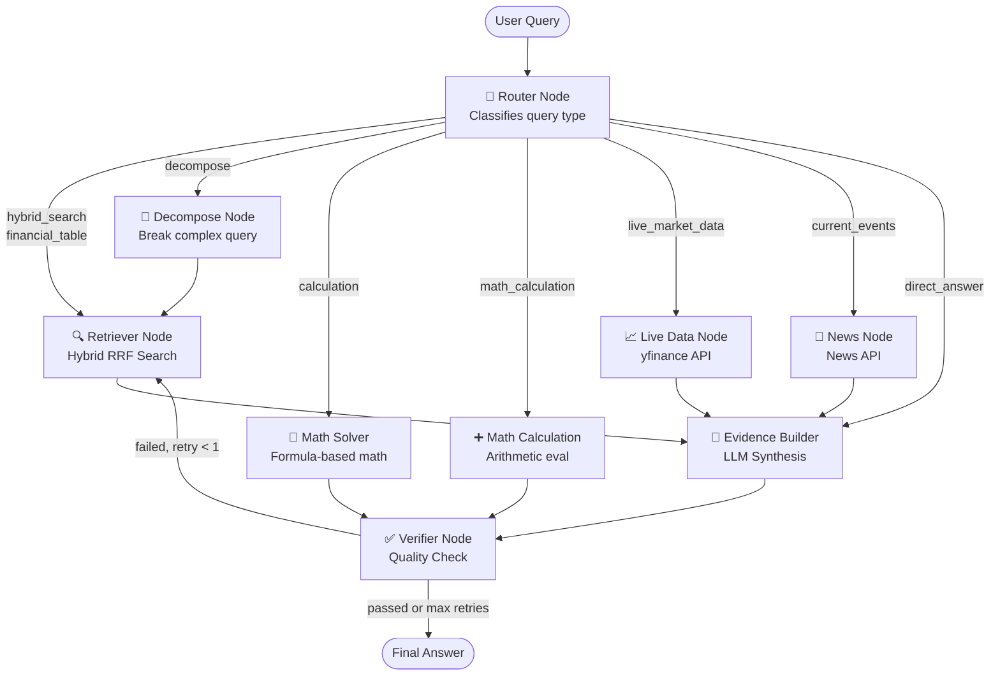
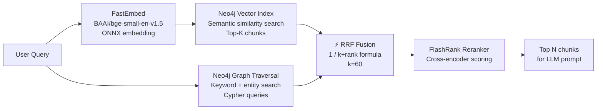
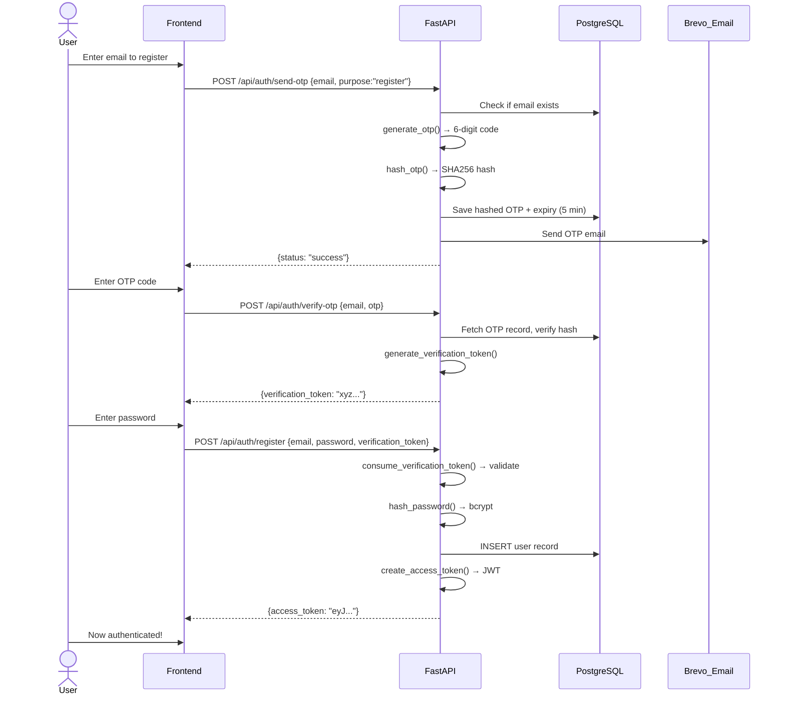
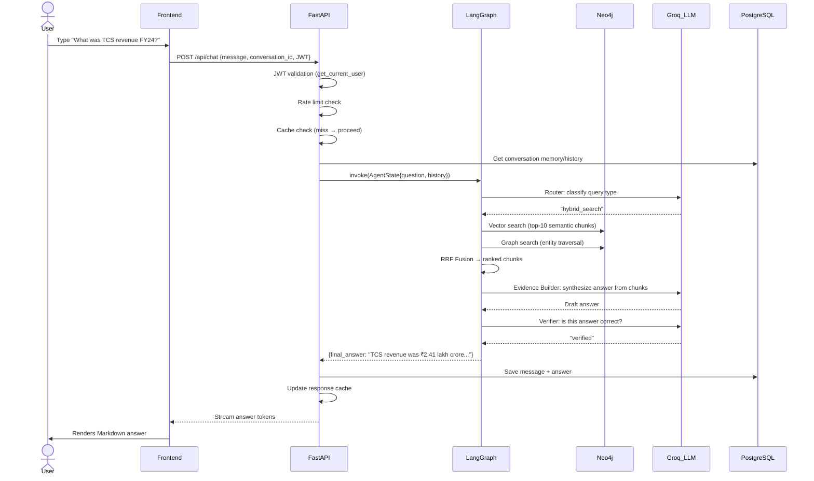
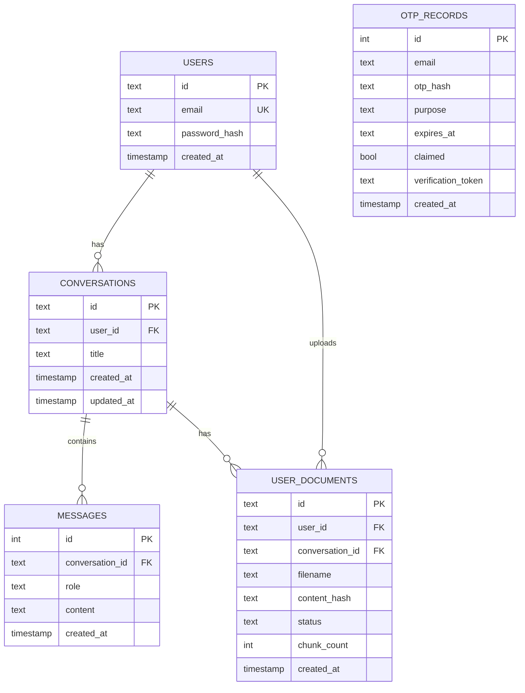

# 🏗️ 02 — High-Level Architecture & Diagrams

## System Architecture Overview

```
┌─────────────────────────────────────────────────────────────────┐
│                        USER'S BROWSER                           │
│  React 19 + TypeScript + Vite + TailwindCSS                     │
│  ┌──────────┐  ┌─────────────┐  ┌─────────────────────────┐    │
│  │LoginPage │  │ ChatUI/App  │  │ ConversationSidebar      │    │
│  │AuthModal │  │ (App.tsx)   │  │ VoiceInputButton         │    │
│  └──────────┘  └─────────────┘  └─────────────────────────┘    │
│          │            │  ▲                                       │
│          │  HTTP/SSE  │  │ JSON / Event Stream                   │
└──────────┼────────────┼──┼───────────────────────────────────────┘
           │            │  │
           ▼            ▼  │
┌──────────────────────────────────────────────────────────────────┐
│                     FASTAPI BACKEND (main.py)                    │
│                                                                  │
│  Middleware Stack:                                               │
│  ┌──────────────────────────────────────────────────────┐       │
│  │ CORS → Rate Limiter → JWT Auth Guard                 │       │
│  └──────────────────────────────────────────────────────┘       │
│                                                                  │
│  API Endpoints:                                                  │
│  POST /api/auth/send-otp    POST /api/auth/verify-otp           │
│  POST /api/auth/register    POST /api/auth/login                 │
│  POST /api/chat             GET /api/conversations               │
│  POST /api/documents/upload DELETE /api/documents/{id}           │
│  GET /api/health                                                 │
│          │                                                       │
│          ▼                                                       │
│  ┌─────────────────────────────────────────────────────┐        │
│  │            LANGGRAPH AI AGENT (graph/workflow.py)   │        │
│  │                                                     │        │
│  │  [router] → [decompose] → [retriever]               │        │
│  │      ↓            ↓           ↓                     │        │
│  │  [math_solver] [live_data] [evidence_builder]       │        │
│  │  [math_calc]  [news_node]      ↓                    │        │
│  │                           [verifier] → END          │        │
│  │                               ↑ (retry loop)        │        │
│  └─────────────────────────────────────────────────────┘        │
└──────────────────────────────────────────────────────────────────┘
           │                 │                    │
           ▼                 ▼                    ▼
┌───────────────┐  ┌──────────────────┐  ┌───────────────────┐
│  NEO4J AURA   │  │   NEON POSTGRES   │  │  EXTERNAL APIs    │
│  (Graph DB)   │  │   (Relational DB) │  │                   │
│               │  │                  │  │  Groq LLM         │
│  - Financial  │  │  - Users         │  │  OpenRouter LLM   │
│    knowledge  │  │  - Conversations │  │  Google Gemini    │
│    graph      │  │  - Messages      │  │  yfinance         │
│  - Vector     │  │  - OTP records   │  │  News API         │
│    index      │  │  - Documents     │  │  Brevo Email      │
│  - Personal   │  │    (metadata)    │  │  LangSmith        │
│    chunks     │  │                  │  │                   │
└───────────────┘  └──────────────────┘  └───────────────────┘
```

---

## LangGraph Agent State Machine



---

## Retrieval Architecture (Hybrid RRF)



---

## Authentication Flow



---

## Chat Request Flow



---

## Database Schema (PostgreSQL — Neon)



---

## Neo4j Graph Schema

```
Shared Corpus (Financial Knowledge Base):
  (Chunk {id, content, embedding[]})
    ← stored in vector index "vector_markdown"
    ← stored in keyword index "keyword_markdown"

Personal Documents (User Uploads):
  (PersonalChunk {
      user_id,          ← security isolation
      document_id,      ← document isolation
      conversation_id,  ← conversation isolation
      content,
      embedding[]
  })
```

---

## LLM Dual-Tier Architecture

```
Fast Chain (< 500ms)          Synthesis Chain (< 5s)
─────────────────────         ──────────────────────────
Used for:                     Used for:
  Router classification         Evidence Builder
  Decomposer                    Complex synthesis
  Verifier                      Full answer generation

Models (priority order):      Models (priority order):
  1. Groq gpt-oss-20b           1. Groq gpt-oss-120b
  2. Groq Qwen-3.8-27B          2. Groq gpt-oss-20b
  3. OpenRouter Mistral-24B     3. OpenRouter Qwen-72B
  4. Google Gemini Flash         4. Google Gemini Flash

Each tier uses .with_fallbacks() — if primary fails,
automatically tries next in chain. Zero manual retry code needed.
```

---

## Component Interaction Map

```
config/settings.py          ← ALL modules read from here
        │
        ▼
core/db.py                  ← Creates LLM chains + embeddings + Neo4j connection
        │
        ├──► nodes/router.py
        ├──► nodes/retriever.py
        ├──► nodes/evidence_builder.py
        ├──► nodes/verifier.py
        ├──► nodes/math_solver.py
        ├──► nodes/math_calculation.py
        ├──► nodes/market_data.py
        └──► nodes/news_data.py
                │
                ▼
        graph/state.py      ← Defines AgentState TypedDict
        graph/workflow.py   ← Wires nodes into LangGraph
                │
                ▼
        main.py             ← FastAPI endpoints invoke workflow
                │
        ┌───────┤
        │       │
        ▼       ▼
core/memory.py  core/auth.py
(PostgreSQL)    (JWT+OTP)
```
